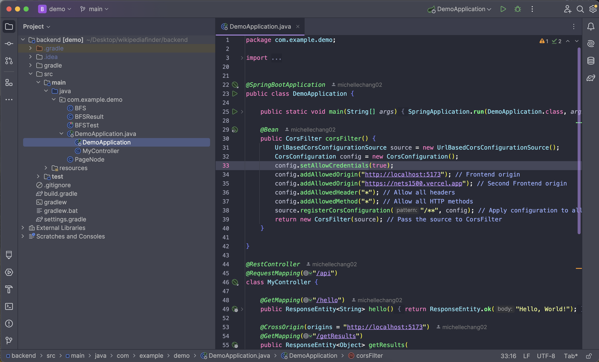
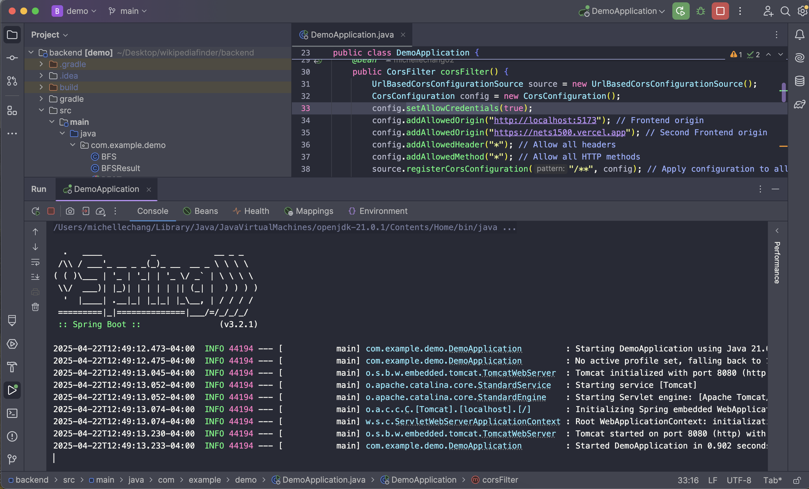
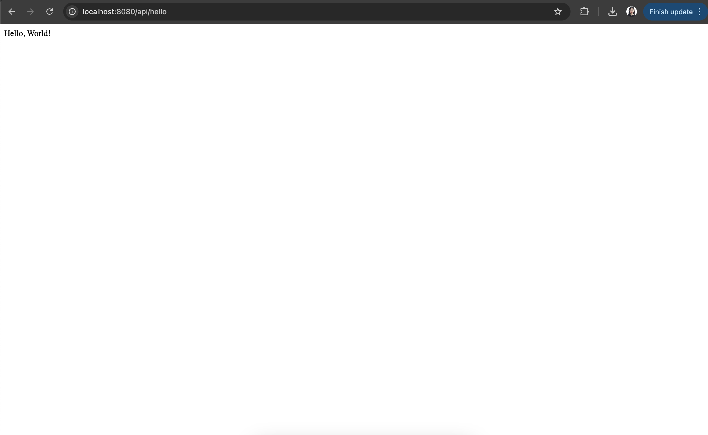
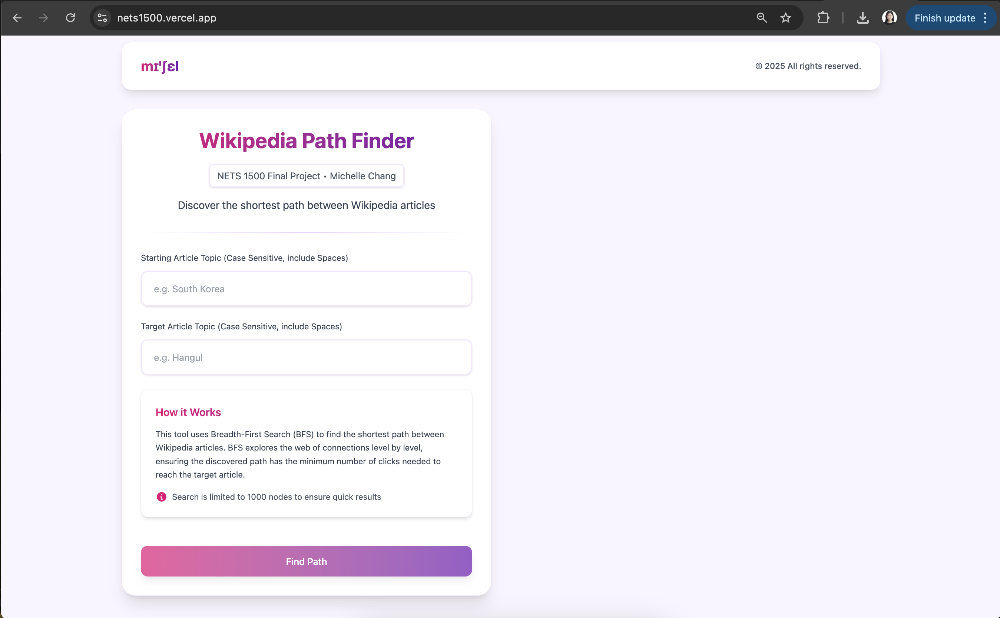
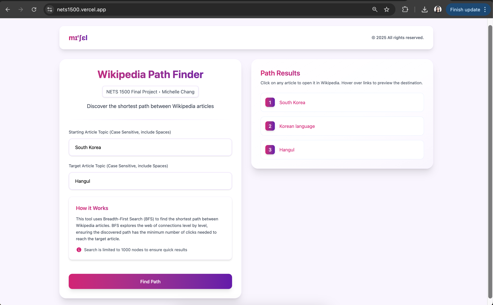
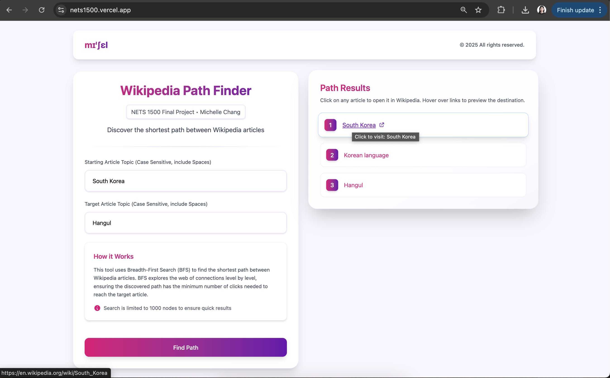

# NETS 1500 HW5: Final Project
## Michelle Chang

# User Manual

# How to run the program

1) Clone this repository (https://github.com/michellechang02/wikipediafinder)
```
git clone git@github.com:michellechang02/wikipediafinder.git
```
2) Open IntelliJ IDEA (or open it after installing IntelliJ)
3) Click Open, and open the backend directory (important!) in IntelliJ. It should look like the following



4) Click the Play button on the top right to start the Java Spring Boot application. Spring Boot should be running in a terminal





5) Visit the following URL in a web browser (Google Chrome recommended)
```
http://localhost:8080/api/hello
```



6) Now, in a web browser, navigate to https://nets1500.vercel.app/



7) Type in a Starting Article Topic (ie. South Korea) and a Target Article Topic (ie. Hangul). Then click Find Path



8) Hover and/or click to navigate to the corresponding Wikipedia Article




