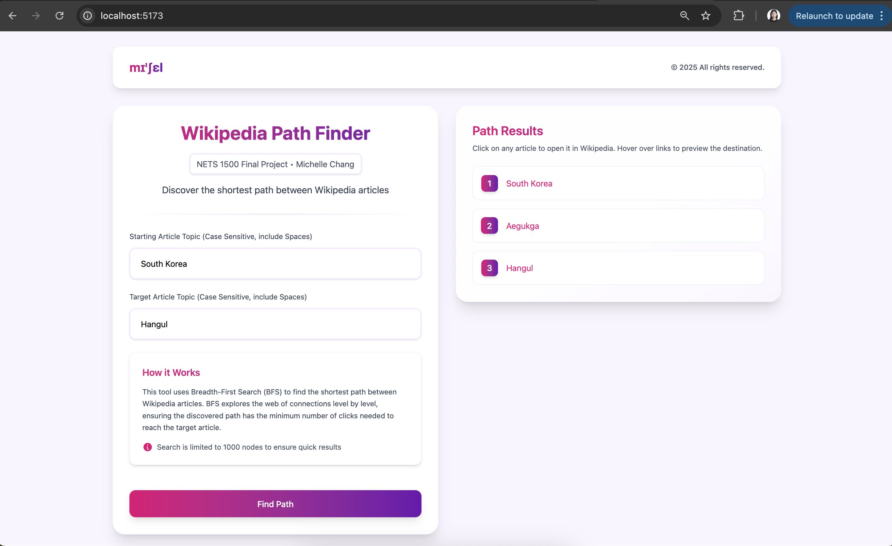

# nets1500


Preview of Application



Frontend - Vite + React + TypeScript

To start the frontend development server, simply run:
```
cd frontend
npm install
npm run dev
```

Open your browser and visit the following URL:
```
http://localhost:5173/
```


Backend - Java Spring Boot (Gradle)

Make sure you have Java 21 installed. On MacOS, you can install it using Homebrew.
```
brew install openjdk@21
```

Run
```
java --version
```
To make sure you have Java 21 installed.


Then, to start the backend server, run:
```
cd backend
./gradlew clean build
./gradlew bootRun
```

To make sure the backend server is running, you can visit the following URL:
```
http://localhost:8080/api/hello
```

You should see the following response:
```
Hello, World!
```

The main api endpoint is:
```
http://localhost:8080/api/getResults?startinglink={startinglink}&endinglink={endinglink}
```


